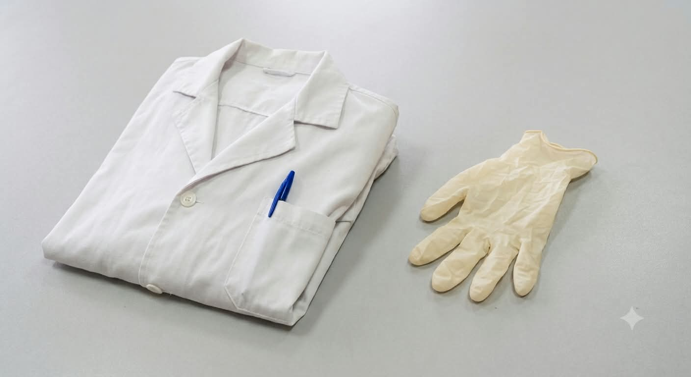
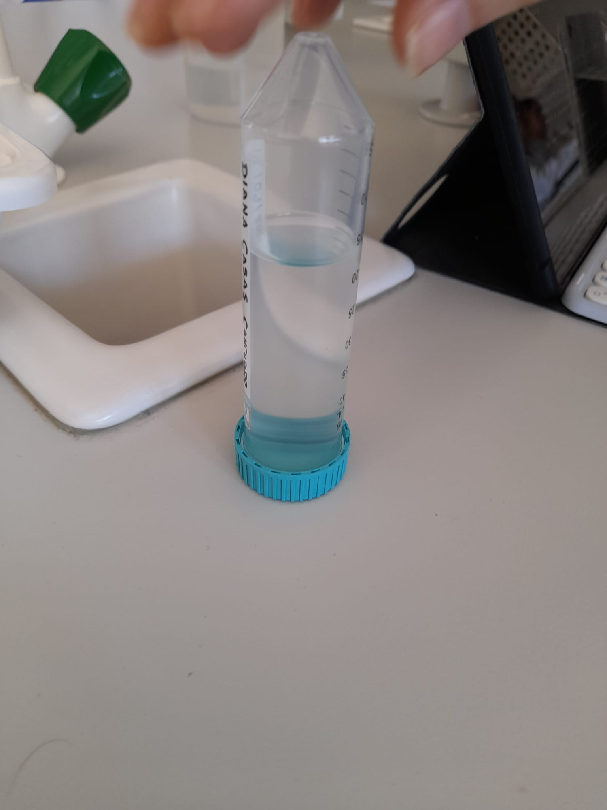
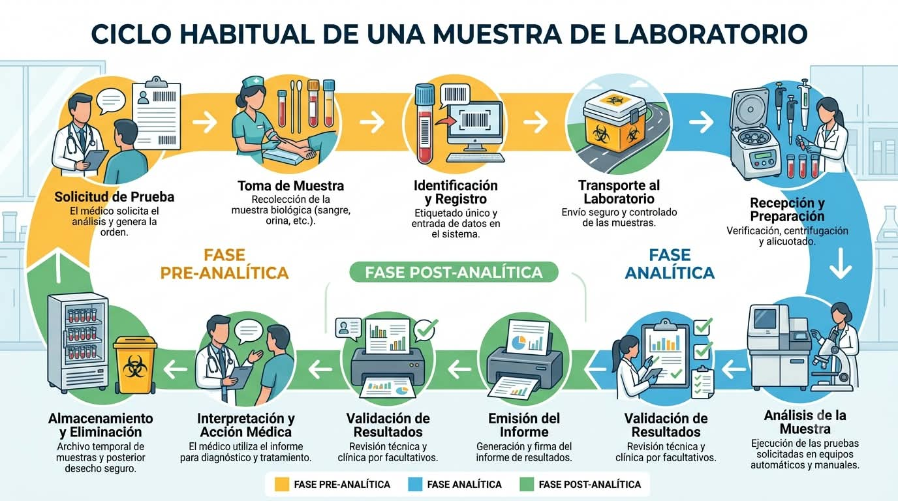
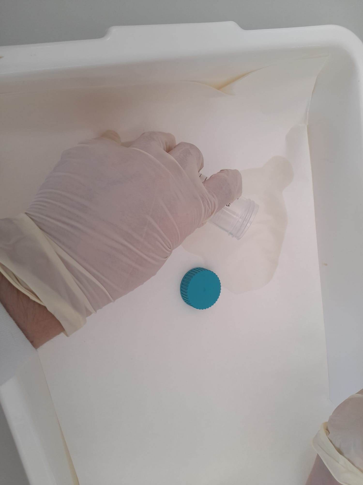
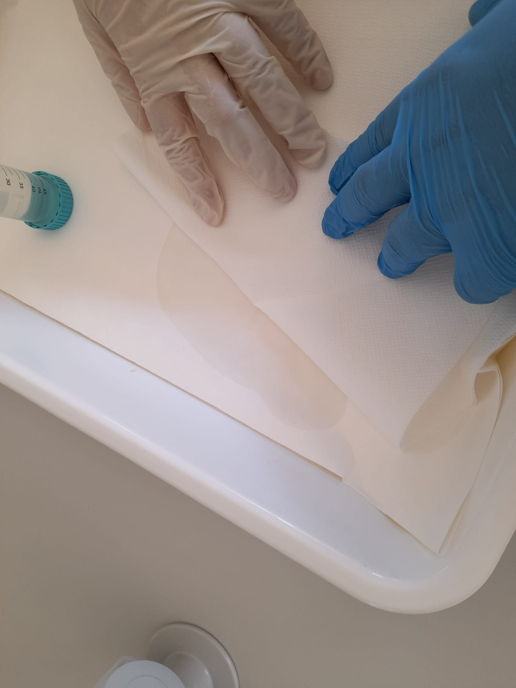

# P01 — Inducción de bioseguridad, riesgos, EPI, residuos y trazabilidad

> **Estado de esta página:** Completa individualmente los bloques **[ALUMNADO · RELLENABLE]** durante o después de la práctica. Si trabajas en pareja, puedes compartir las imágenes del proceso, pero tu registro, interpretación y reflexión deben ser personales.

## 1. Identificación de la práctica

| Campo | Información |
|---|---|
| Código y título | `P01 — Inducción de bioseguridad, riesgos, EPI, residuos y trazabilidad` |
| Unidad didáctica | `UD1 — La microbiología` |
| Resultado de aprendizaje | `RA01` |
| Criterios de evaluación | `CE01.a–CE01.i` |
| Modalidad prevista | Recepción simulada de una muestra líquida, simulación controlada de derrame y resolución individual del registro. |
| Modalidad de seguridad | Actividad sin manipulación de cultivos ni muestras clínicas. Se utilizará una muestra líquida no biológica y material limpio, salvo autorización expresa y procedimiento validado por el centro. |

## 2. Resumen

En esta práctica aprenderás a recibir una muestra líquida de forma segura y trazable y a responder ante un derrame simulado. Analizarás el espacio de recepción, la señalización y los peligros antes de seleccionar barreras y EPI. Con una muestra no biológica revisarás la documentación, la identificación, la integridad del envase y el acondicionamiento antes de aceptarla o aislarla. Después provocarás un derrame controlado y aplicarás la respuesta prevista: detener la actividad, señalizar, comunicar, contener, descontaminar y gestionar los residuos. Registrarás las decisiones, los tiempos y las desviaciones. El resultado será un circuito documentado que conecte recepción, incidente, eliminación y trazabilidad, sin manipular muestras clínicas ni cultivos reales.

## 3. Finalidad y resultados esperados

Esta práctica convierte la bioseguridad en un desempeño previo obligatorio, no en un contenido únicamente teórico. Al terminarla deberás poder:

- analizar el espacio de recepción, su señalización y sus condiciones de seguridad;
- identificar peligros y fuentes potenciales de contaminación;
- seleccionar correctamente las barreras y los equipos de protección individual (EPI);
- recibir una muestra líquida simulada y comprobar su documentación, identificación e integridad;
- responder ante un derrame simulado sin generar exposición ni contaminación secundaria;
- segregar, procesar y eliminar los residuos por la ruta autorizada; y
- registrar las decisiones, las incidencias y la trazabilidad de toda la actuación.

## 4. Recursos, riesgos y condiciones de ejecución

**Recursos previstos:** zona de recepción señalizada, muestra líquida no biológica en recipiente primario estanco, documentación o formulario de solicitud simulado, etiquetas, bandeja de contención, recipiente secundario hermético, EPI, material absorbente, pinzas o recogedor, recipientes de residuos y desinfectante validado por el centro.

**Riesgos que se trabajan:** aceptación de una muestra mal identificada o con fugas, salpicaduras, contaminación de superficies, generación de aerosoles durante un derrame, contacto con desinfectantes y segregación incorrecta de residuos.

**Condiciones de ejecución:** la actividad se realizará con una muestra líquida segura, no biológica, preferentemente coloreada para hacer visible el derrame. No se abrirán ni cultivarán muestras clínicas, ni se utilizarán agentes biológicos reales. El ejercicio se desarrollará con supervisión y se detendrá ante cualquier condición no prevista.

**Medidas generales:** seguir el procedimiento normalizado de trabajo (PNT) del centro, mantener el puesto despejado, separar la documentación de la muestra, usar el EPI indicado, aplicar higiene de manos y respetar el circuito de residuos comunicado por el centro.

**PNT de referencia alternativo:** si el centro no dispone de documentación de referencia validada para la recepción, conservación, descontaminación y gestión de residuos, se tomará como referencia el [Manual de bioseguridad en el laboratorio, cuarta edición, de la OMS (descarga directa del PDF)](https://iris.who.int/bitstream/handle/10665/365600/9789240059306-spa.pdf?sequence=1). Sus indicaciones deberán adaptarse a las instalaciones, los recursos y las normas vigentes del centro; no sustituyen la autorización local.

> **Aviso de seguridad.** La recepción y el derrame se simulan con material no biológico. Los protocolos internos de bioseguridad, residuos e incidencias deben estar validados por el centro antes de aplicarlos como procedimiento real. Esta página no sustituye esos protocolos ni autoriza la manipulación de muestras clínicas.

## 5. Secuencia prevista y criterios de calidad

### Secuencia general

1. Analizar el espacio de trabajo y su señalización.
2. Identificar peligros y fuentes potenciales de contaminación.
3. Seleccionar barreras y EPI adecuados.
4. Llevar a cabo la recepción de la muestra de manera correcta, según el PNT aplicable.
5. Simular un incidente por derrame de la muestra líquida.
6. Resolver la simulación del incidente de manera correcta y segura.
7. Segregar, procesar y eliminar correctamente los residuos propuestos.
8. Registrar la actuación y las decisiones tomadas.

### Procedimiento específico

**[PNT](https://iris.who.int/bitstream/handle/10665/365600/9789240059306-spa.pdf?sequence=1) de referencia:** [OMS, Manual de bioseguridad en el laboratorio, cuarta edición](https://iris.who.int/bitstream/handle/10665/365600/9789240059306-spa.pdf?sequence=1). Si existe un PNT local validado, prevalece sobre esta referencia.

1. Delimita la zona de recepción y revisa señalización, iluminación, bandeja, absorbente y residuos; mantén la documentación separada y el paso despejado.
2. Comprueba solicitud, identificación, origen, fecha, prueba, cierre, integridad y correspondencia del recipiente simulado; registra cualquier fuga o discrepancia sin abrirlo.
3. Selecciona bata, guantes y protección ocular; verifica talla, integridad y colocación. Añade protección facial o barrera secundaria si el riesgo lo exige.
4. Recibe la muestra simulada en un recipiente secundario estanco; acéptala solo si es trazable e íntegra. Aísla, cierra y comunica cualquier envase irregular.
5. Provoca el derrame controlado dentro de una bandeja con líquido no biológico; detén la actividad, avisa, señaliza y restringe el acceso sin tocar ni barrer.
6. Cubre el derrame con absorbente, aplica el desinfectante validado desde el perímetro hacia el centro y respeta el tiempo de contacto; recoge con útiles, nunca con las manos.
7. Segrega absorbentes y líquidos según la ruta autorizada; deposita punzantes en contenedor rígido, descontamina reutilizables y no mezcles residuos incompatibles.
8. Retira el EPI de forma segura, realiza higiene de manos, restablece la zona y completa el registro de recepción, derrame, residuos, decisiones y desviaciones.

### Controles de calidad

- Análisis completo de la zona, la señalización y los peligros.
- Recepción trazable y decisión justificada ante envases conformes o irregulares.
- Selección coherente del EPI, contención y descontaminación segura del derrame.
- Segregación, procesamiento y eliminación correctos según la ruta autorizada.
- Registro completo, claro y trazable.

---

# Tu cuaderno de prácticas

## 6. Datos de realización [ALUMNADO · RELLENABLE · DURANTE]

- **Nombre y apellidos:** [Escribe tu nombre y apellidos]
- **Fecha real de realización:** [dd/mm/aaaa]
- **Grupo:** [Indica tu grupo]
- **Pareja o equipo, si procede:** [Indica los nombres o escribe “Trabajo individual”]
- **Rol o tarea principal que realizaste:** [Describe tu participación]
- **Modalidad realmente realizada:** [Real / simulación con material limpio / actividad documental / otra; descríbela]
- **Tipo de muestra líquida simulada:** [Describe el material seguro utilizado]
- **Código o identificación de la muestra:** [Completa sin datos personales]

## 7. Preparación del puesto y análisis inicial [ALUMNADO · RELLENABLE · DURANTE]

### 7.1 Observación del espacio

Describe brevemente cómo estaba organizado el puesto, qué señalización observaste y qué elementos consideraste relevantes para trabajar con seguridad.

[Escribe aquí tu observación inicial.]

### 7.2 Riesgos identificados

| Riesgo o fuente de contaminación | Consecuencia posible | Medida preventiva seleccionada |
|---|---|---|
| [Completa] | [Completa] | [Completa] |
| [Completa] | [Completa] | [Completa] |
| [Completa] | [Completa] | [Completa] |

### 7.3 EPI y barreras seleccionados

| Elemento | ¿Se utilizó? | Justificación técnica |
|---|---|---|
| Bata u otra prenda de protección | [Sí / No / No aplicaba] | [Completa] |
| Guantes | [Sí / No / No aplicaba] | [Completa] |
| Protección ocular o facial | [Sí / No / No aplicaba] | [Completa] |
| Higiene de manos | [Describe cuándo y cómo] | [Completa] |
| Otra barrera o medida | [Completa] | [Completa] |

## 9. Controles y resultados [ALUMNADO · RELLENABLE · DURANTE]

### 9.1 Comprobación de los controles de calidad

| Control o criterio | Evidencia observada | ¿Resultado válido? | Justificación |
|---|---|---|---|
| Zona y señalización analizadas | [Completa] | [Sí / No / Parcialmente] | [Completa] |
| Recepción e identificación trazables | [Completa] | [Sí / No / Parcialmente] | [Completa] |
| Derrame contenido y descontaminado | [Completa] | [Sí / No / Parcialmente] | [Completa] |
| Residuos procesados y eliminados correctamente | [Completa] | [Sí / No / Parcialmente] | [Completa] |
| Registro y comunicación final | [Completa] | [Sí / No / Parcialmente] | [Completa] |

### 9.2 Resultado principal de la práctica

Resume qué demuestran tus evidencias sobre tu capacidad para analizar la recepción, aceptar o aislar una muestra, responder a un derrame, gestionar residuos y documentar una actuación segura.

[Escribe aquí el resultado principal.]

## 10. Evidencias visuales [ALUMNADO · RELLENABLE · DURANTE Y DESPUÉS]

> Sube imágenes propias y pertinentes. No incluyas rostros, datos personales, documentación sensible ni material cuya fotografía esté prohibida por el centro. Si la imagen procede de una simulación, de material docente o de una fuente externa autorizada, indícalo expresamente. Una imagen no sustituye la explicación técnica.

### Imagen 1 — Preparación o selección de EPI

- **Pie de foto:** [Qué se observa y qué medida preventiva demuestra]
- **Autoría y origen:** [Propia / compartida con tu pareja / material docente autorizado]
- **Momento del procedimiento:** [Completa]

### Imagen 2 — Recepción correcta de la muestra

- **Pie de foto:** [Qué se observa: documentación, identificación, integridad, recipiente secundario o zona de recepción]
- **Comprobación técnica asociada:** [Explica por qué la recepción es conforme o por qué la muestra se aislaría]
- **Momento del procedimiento:** [Completa]

### Imagen 3 — Workflow o ciclo habitual de una muestra

- **Pie de figura:** [Describe las fases representadas: recepción, identificación, procesamiento, almacenamiento o eliminación]
- **Origen y autorización:** [Esquema propio / material docente autorizado / otra fuente; indica cuál]
- **Relación con el procedimiento:** [Explica qué fase de la práctica se conecta con el ciclo]

### Imagen 4 — Simulación del derrame y respuesta inicial

- **Pie de foto:** [Qué se observa: señalización, contención, absorbente o aplicación del desinfectante]
- **Medida crítica demostrada:** [Explica qué riesgo se controla]
- **Momento del procedimiento:** [Completa]

### Imagen 5 — Procesamiento y eliminación correcta de la muestra

- **Pie de foto:** [Qué residuo se procesa, en qué recipiente se deposita y qué tratamiento se aplica]
- **Ruta autorizada:** [Completa según el protocolo del centro]
- **Relación con la trazabilidad:** [Explica qué registro o decisión respalda]

## 11. Incidencias, errores y medidas correctoras [ALUMNADO · RELLENABLE · DURANTE]

| Incidencia, error o duda detectada | Posible causa | Medida correctora aplicada o propuesta | ¿Afectó al resultado? |
|---|---|---|---|
| [Completa o escribe “No se detectaron incidencias”] | [Completa] | [Completa] | [Sí / No; explica] |

## 12. Interpretación técnica [ALUMNADO · RELLENABLE · DESPUÉS]

Interpreta los resultados de la práctica. Relaciona el análisis de la zona, la recepción de la muestra, el EPI seleccionado, la respuesta al derrame y el procesamiento de residuos. Justifica tus decisiones con el PNT del centro o, si no existe, con el manual de la OMS enlazado en el apartado 4.

[Escribe aquí tu interpretación técnica.]

## 13. Conclusión [ALUMNADO · RELLENABLE · DESPUÉS]

Indica si alcanzaste el objetivo de la práctica y qué evidencias concretas lo demuestran. Menciona también alguna limitación de la simulación o de la actividad realizada.

[Escribe aquí tu conclusión.]

## 14. Reflexión profesional [ALUMNADO · RELLENABLE · DESPUÉS]

Responde de forma razonada a las cuatro preguntas. Relaciona cada respuesta con datos, observaciones o imágenes incluidas en tu cuaderno.

1. **Procedimiento:** ¿Qué comprobación de la recepción o del derrame consideraste más crítica para evitar una exposición o contaminación, y cómo verificaste que se realizó correctamente?

   [Respuesta del alumnado]

2. **Interpretación:** Ante el derrame simulado, ¿qué indicios utilizaste para decidir la contención, la descontaminación y el circuito de residuos? Explica por qué descartaste otras opciones.

   [Respuesta del alumnado]

3. **Conclusiones:** ¿Qué evidencia demuestra con mayor claridad que la muestra fue recibida, procesada o eliminada de forma segura y trazable? Justifica la elección.

   [Respuesta del alumnado]

4. **Aprendizaje y transferencia:** ¿Qué hábito concreto aplicarás en las próximas prácticas de microbiología y cómo ayudará a prevenir errores o riesgos reales?

   [Respuesta del alumnado]

## 15. Trazabilidad y entrega [ALUMNADO · RELLENABLE · DESPUÉS]

| Campo | Registro del alumnado |
|---|---|
| Identificador de práctica | `P01` |
| Fecha | [dd/mm/aaaa] |
| UD / RA / CE | `UD1 / RA01 / CE01.a–CE01.i` |
| Agrupamiento | [Individual / pareja / equipo; especifica] |
| Materiales o lotes relevantes | [Completa o escribe “No aplicaba”] |
| Controles | [Resume o enlaza al apartado 9] |
| Resultado | [Resume o enlaza al apartado 9.2] |
| Interpretación | [Resume o enlaza al apartado 12] |
| Incidencias y acciones correctoras | [Resume o enlaza al apartado 11] |
| Ruta de residuos aplicada | [Completa]
| Estado de entrega | [Borrador / pendiente de revisión / entregado / corregido] |

---
